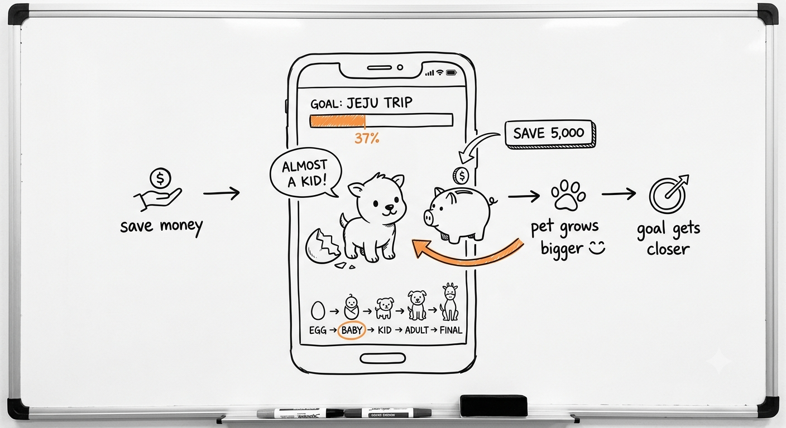
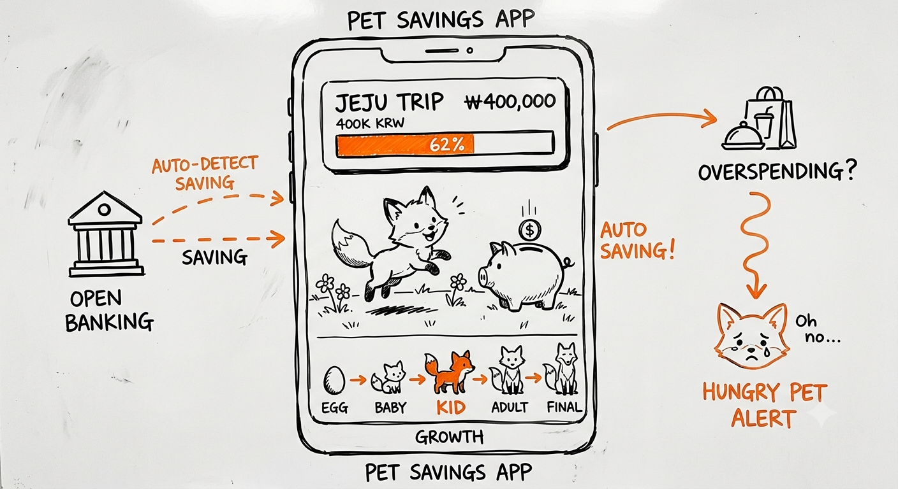

# Design Thinking Pipeline

디자인씽킹 6단계(Empathize → Define → Ideate → Prototype → Test → Assess) 전체를 스텝별 서브에이전트 파이프라인으로 실행하는 [Claude Code](https://claude.com/claude-code) 스킬.

SMART 목표를 입력하면 인터뷰 설계 → 인사이트 정의 → 아이디어 시트 → 컨셉 시트 → POINT 평가 → 사업성(VIP) 평가까지 산출물이 체인으로 이어진다. 실제 인터뷰 수행 구간만 사람이 개입한다.

| 아이디어 스케치 | 제품 일러스트 | 사용 장면 일러스트 |
|---|---|---|
|  |  |  |

파이프라인 텍스트 산출물에서 [I2]/[P2] 스텝이 자동 생성한 이미지 (Gemini/Nano Banana). 전체 예시: [examples/2026-07-11-goal-pet-saving/](examples/2026-07-11-goal-pet-saving/)

## 사용법

이 폴더를 Claude Code에서 열면 `.claude/skills/design-thinking/`이 자동 인식된다. `/design-thinking`을 호출하면 SKILL.md의 라우팅을 따른다.

```
/design-thinking empathize SMART 목표: ... / 가용 자원: 팀원 5명, 1주일
/design-thinking define {인터뷰 원본 결과 붙여넣기}
/design-thinking ideate 콘센트에 꽂으면 바로 거치되는 무선 충전기
/design-thinking 전체 {SMART 목표}
```

인자 없이 `/design-thinking`만 입력하면 실행 가능한 단계 목록을 보여준다.

### MCP 서버로 쓰기 (Claude Code 밖에서)

같은 방법론을 **MCP를 지원하는 어떤 클라이언트에서든** 쓸 수 있도록 MCP 서버를 제공한다. 의존성 없이 Node.js만 있으면 실행된다.

```jsonc
// Claude Desktop: claude_desktop_config.json
{
  "mcpServers": {
    "design-thinking": {
      "command": "node",
      "args": ["/절대/경로/DesignThinking/mcp/server.mjs"]
    }
  }
}
```

Claude Code에 붙일 때는 `claude mcp add design-thinking -- node /절대/경로/DesignThinking/mcp/server.mjs`.

| 도구 | 하는 일 |
|---|---|
| `list_stages` | 11개 스텝의 순서·입력·출력과 **사람이 개입해야 하는 지점**을 반환 |
| `get_pipeline_overview` | 단계 간 데이터 전달 규칙, 이미지 스텝 처리, 산출물 저장 규칙 |
| `get_stage_guide(stage)` | 해당 스텝의 작업 지침 전문 (역할·임무·출력 양식·규칙) |
| `get_stage_example(stage)` | 해당 스텝의 실제 완성 산출물 예시 (형식 참고용) |

**이 서버는 LLM을 호출하지 않는다.** 각 스텝의 지침과 예시를 제공할 뿐이고, 산출물 생성은 클라이언트 쪽 모델이 수행한다. 서버가 보유한 자산은 모델이 아니라 **방법론**(무엇을 어떤 순서로, 무엇을 다음 단계에 넘겨서, 어디서 사람을 기다려야 하는지)이다. 덕분에 서브에이전트 기능이 없는 클라이언트에서도 같은 파이프라인을 돌릴 수 있다.

프로토콜 테스트:

```bash
printf '%s\n' \
  '{"jsonrpc":"2.0","id":1,"method":"initialize","params":{"protocolVersion":"2024-11-05","capabilities":{}}}' \
  '{"jsonrpc":"2.0","id":2,"method":"tools/list"}' | node mcp/server.mjs
```

### 이미지 생성 설정 (선택)

스케치([I2])와 컨셉 일러스트([P2])를 실제 이미지 파일로 받으려면 Gemini API 키(무료)를 설정한다.

1. https://aistudio.google.com/apikey 에서 API 키 발급
2. 환경변수 설정: `setx GEMINI_API_KEY "발급받은키"` (Windows) / `export GEMINI_API_KEY=발급받은키` (macOS·Linux)

키가 설정되면 이미지 스텝이 `scripts/generate_image.py`(의존성 없음, 표준 라이브러리만 사용)로 화이트보드 스케치 스타일 PNG를 `output/`에 저장한다. 키가 없으면 영문 이미지 프롬프트가 산출물이 되며, 외부 이미지 모델에 붙여넣어 쓸 수 있다. 모델은 기본 `gemini-2.5-flash-image`(Nano Banana)이고 `GEMINI_IMAGE_MODEL` 환경변수로 바꿀 수 있다.

## 구조

```
.claude/
  skills/design-thinking/
    SKILL.md                        ← 오케스트레이터: 라우팅 + 파이프라인 정의 + 실행 규칙
    scripts/
      generate_image.py             ← Gemini API(Nano Banana) 이미지 생성 (GEMINI_API_KEY 필요)
  agents/                           ← 스텝별 서브에이전트 (각각 독립 컨텍스트에서 실행)
    dt-e1-interviewee-strategy.md   ← [E1] 인터뷰 대상자 선정기준 + 섭외전략
    dt-e2-questionnaire.md          ← [E2] 유형별 인터뷰 질문지 생성
    dt-d1-clustering.md             ← [D1] 인터뷰 결과 클러스터링
    dt-d2-pov.md                    ← [D2] POV 진술서 생성
    dt-d3-prioritize.md             ← [D3] POV 우선순위 평가 (시장영향력/차별화)
    dt-i1-idea-sheet.md             ← [I1] 아이디어 시트 생성
    dt-i2-sketch.md                 ← [I2] 아이디어 스케치 (영문 프롬프트 + 이미지)
    dt-p1-concept-sheet.md          ← [P1] 컨셉 시트 생성
    dt-p2-illustration.md           ← [P2] 컨셉 일러스트 (제품뷰+사용장면)
    dt-t1-point.md                  ← [T1] POINT 프레임워크 평가
    dt-a1-vip.md                    ← [A1] VIP 평가 + Core Components
mcp/
  server.mjs                        ← MCP 서버 (의존성 0, stdio JSON-RPC) — 위 자산을 도구로 노출
output/                             ← 실행 결과 저장 위치
```

## 설계 의도

- **단일 프롬프트가 아니라 11개 서브에이전트로 분해한 이유** — 단계마다 요구되는 역할(리서치 기획자, UX 리서처, 전략 기획자, 비주얼 퍼실리테이터...)과 출력 양식이 전혀 달라서, 하나의 긴 프롬프트로 합치면 앞 단계의 컨텍스트가 뒤 단계 출력을 오염시킨다. 각 스텝은 매번 새 컨텍스트의 서브에이전트로 실행되어 "직전 스텝의 출력 + 자기 시스템 프롬프트"만 근거로 삼는 Stateless 원칙이 구조적으로 보장된다. 각 에이전트는 최소 권한 원칙으로 텍스트 스텝은 Read만, 이미지 스텝만 Write/Bash를 가진다. SKILL.md는 단계 간 데이터 전달과 사용자 개입 지점을 관리하는 오케스트레이터다.
- **인터뷰 구간([E2]→[D1])을 자동화하지 않은 이유** — 인터뷰 데이터는 파이프라인 전체의 근거가 되는 유일한 실측 데이터다. AI가 이 구간을 지어내면 이후 모든 산출물이 그럴듯한 할루시네이션이 된다. 그래서 이 구간은 반드시 사용자 입력을 기다리도록 규칙으로 강제했다.
- **이미지 스텝은 '프롬프트 먼저, 생성은 환경에 따라'** — Claude Code는 자체 이미지 생성이 불가능하다. 그래서 [I2]/[P2]는 항상 스타일 가이드가 전부 반영된 완성형 영문 프롬프트를 먼저 산출하고, Gemini API 키가 있으면 내장 스크립트로 이미지까지 생성하며, 없으면 프롬프트 자체가 (외부 이미지 모델에 붙여넣을 수 있는) 최종 산출물이 된다. 어떤 환경에서도 파이프라인이 끊기지 않는다.
- **평가 기준을 프롬프트에 하드코딩하지 않고 가중치로 노출** — POV 우선순위([D3])의 시장영향력/차별화 가중치(기본 1/3 : 2/3)는 사용자가 재지정할 수 있다.

## 출처

각 프롬프트는 캡스톤디자인 수업(Design Thinking, Prof. Do-Hyung Park) 강의자료의 프레임워크(POV, HMW, Idea Sheet, Concept Sheet, POINT, VIP&Core Components)를 참고해 재구성함. 강의자료 원문은 재게시하지 않음 — 프레임워크 구조만 프롬프트 형태로 재작성.

## 예시 산출물

실제 인터뷰 데이터(익명 처리)로 E1→A1 전 단계를 완주한 예시(위 이미지 포함): [examples/2026-07-11-goal-pet-saving/](examples/2026-07-11-goal-pet-saving/)

인터뷰 설계 → 실측 인터뷰 → POV 도출·우선순위화 → 아이디어 시트 → 컨셉 시트 → POINT 평가 → New Thinking 반영 갱신 → VIP/Core Components까지 파이프라인의 모든 산출물과 단계 간 데이터 전달을 확인할 수 있다.

## Roadmap

- [x] 전 단계를 실제 주제로 완주한 예시 산출물을 `examples/`에 추가
- [x] 각 스텝을 `.claude/agents/` 서브에이전트로 분리해 컨텍스트 격리를 구조적으로 보장
- [x] Gemini API(Nano Banana) 연동 스크립트로 [I2]/[P2]에서 이미지 파일을 `output/`에 직접 저장
- [x] 예시 산출물의 영문 프롬프트로 생성한 실제 스케치 이미지를 `examples/`에 추가
- [x] MCP 서버(`mcp/server.mjs`)로 파이프라인을 노출해 Claude Code 밖의 클라이언트에서도 사용 가능하게

## License

[MIT](LICENSE)
